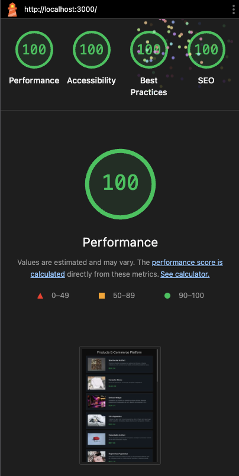
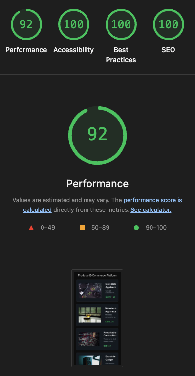
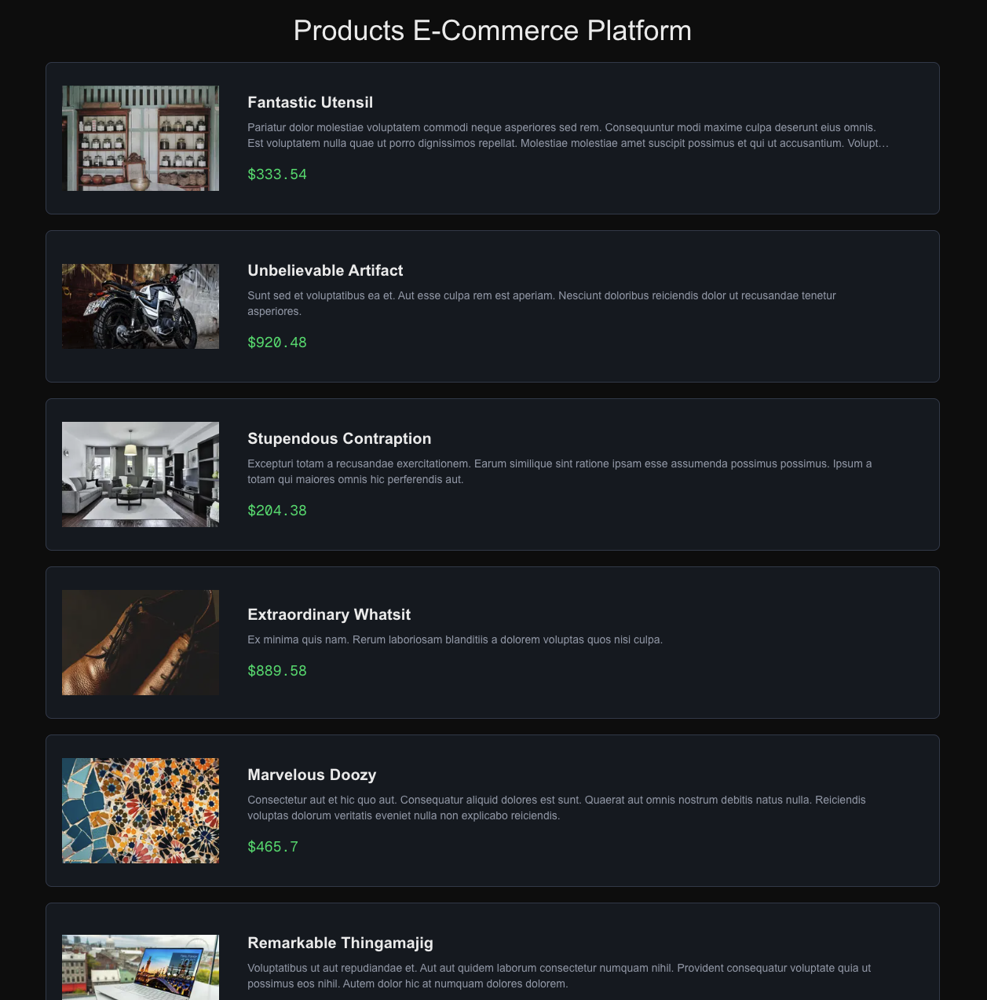
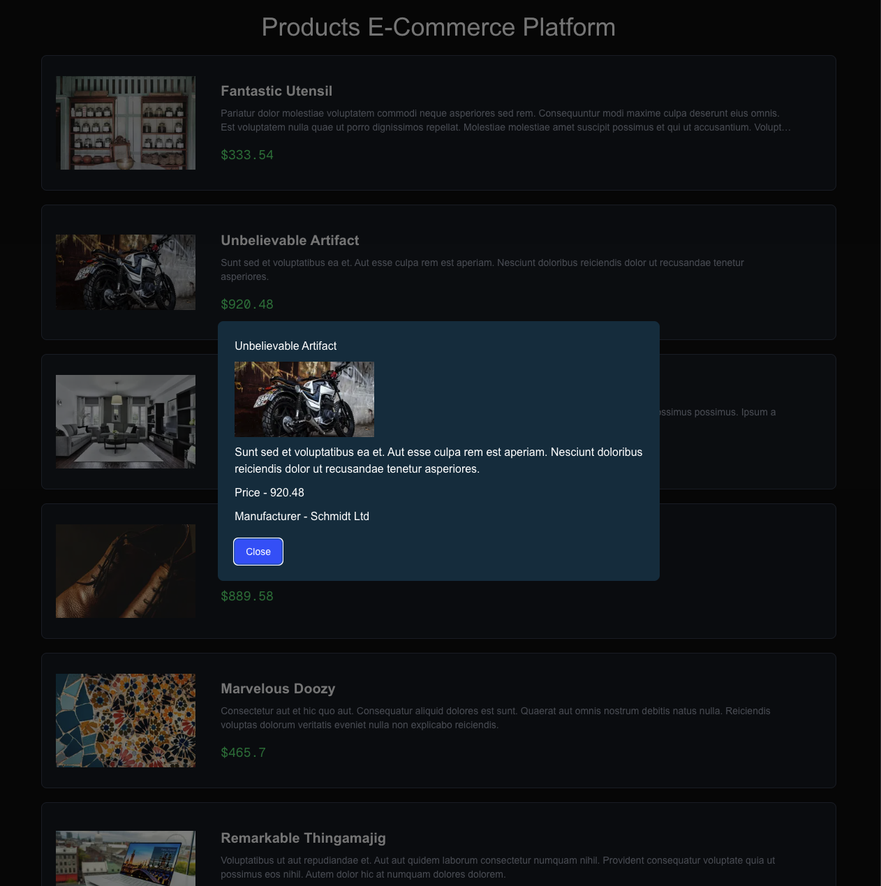
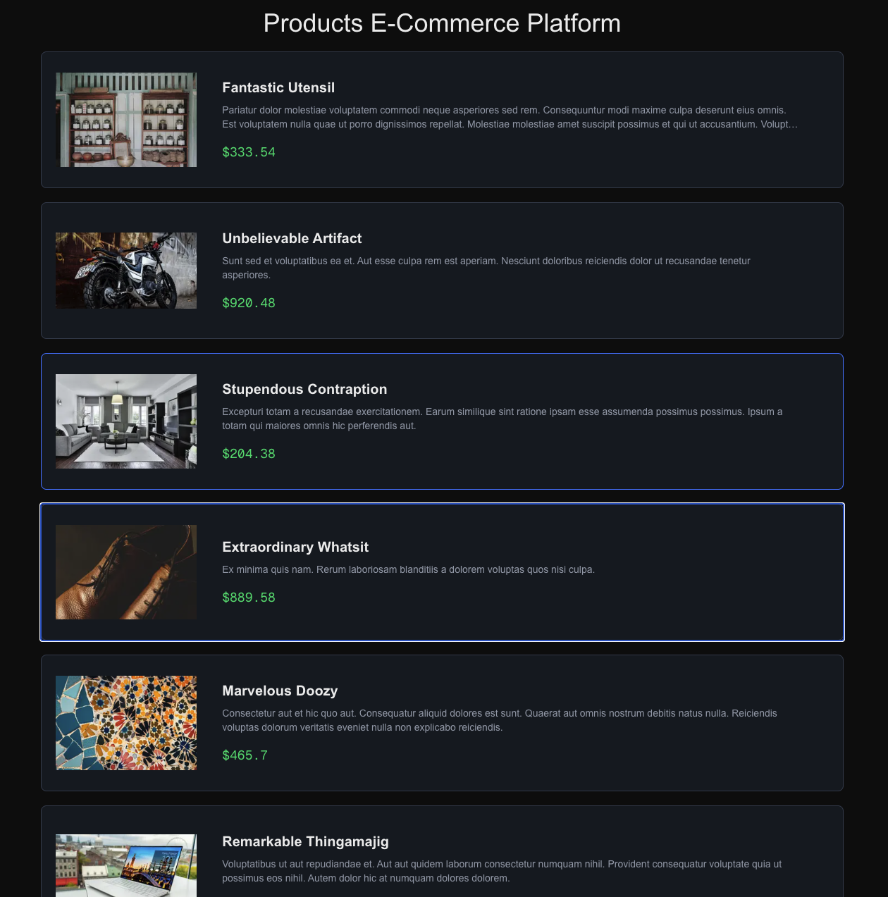

# Assignment Questions

## 1. What makes this page SEO-friendly?

- **Server-Side Rendering** - Content is rendered on server, making it fully accessible to search engine crawlers
- **Metadata Management**: Uses Next.js's built-in metadata API for managing page titles and descriptions.
- **Semantic HTML**: Employs proper HTML structure with tags like `<header>, <main>, <article>, <h1>, and <h2>`, which helps search engines understand the content hierarchy.
- **Image Optimization**: Leverages next/image with crucial SEO features like descriptive alt text, the priority prop for faster loading of key images, and the sizes attribute for responsive performance.

## 2. What would you change if the catalog had 100,000 products?

- **Pagination** - Would add next and previous buttons or infinite scroll
  api would like for example - `/api/products?page=1&limit=24` incase of pagination (right now is dummy, while incorporating actual)
- **Static Site Generation (SSG)** - Would create dynamic route for individual product details (e.g., `app/products/[productId]/page.tsx`). Using Next.js's _generateStaticParams_, all 100,000 product pages could be pre-rendered as static HTML at build time. This makes them incredibly fast to load, highly cacheable, and excellent for SEO.
- **Incremental Static Generation (ISR)** - Periodically would allow nextjs to update individual static pages in the background after a certain time interval, ensuring data stays fresh without needing to rebuild the entire site.
- **Dynamic Sitemap Generation** - Would create a script to dynamically create sitemap.xml files. Crucial to discover all 100,000 products.
- **Dynamic Metadata** - Each statically generated product page has its own metadata based on product.

## 3. What SEO mistakes do frontend engineers commonly make?

- **Impropert HTML Structure** - Misusing heading tags. eg. `div`s everywhere and using non-link elements like `<button>` for navigation hiding page connections from crawlers
- Using CSR only for rendering. Initial HTML empty. Forces browser to render page with javascript.
- **Neglecting Core Metadata**: forgetting `title,alt` like atttibutes
- **Poor mobile experience:** unresponsive and slow on mobile which hurts rankings due to Google' mobile-first indexing

# Below is the default README from nextjs

## 4. How does SEO differ between a client-side React SPA and an SSR/SSG approach?

- **Client-Side SPA**:
  - Initial HTML is empty or limited
  - Search engines may not execute JavaScript or wait for content to load
  - Used for non-critical pages
- **SSR/SSG**:
  - Server generates initial HTML with content
  - Improves crawling, indexing, and page speed
  - Used for SEO-critical pages

## 5. How would you measure SEO and performance in production?

**SEO Metrics:**

- Google Search Console: Monitor search engine rankings, impressions, and clicks
- Google Analytics: Track organic traffic, bounce rates, and conversion rates

**Performance Metrics:**

- Page Speed Insights: Measure page load times, performance scores
- Web Vitals: Monitor Core Web Vitals (LCP, FID, CLS) for user experience

This is a [Next.js](https://nextjs.org) project bootstrapped with [`create-next-app`](https://nextjs.org/docs/app/api-reference/cli/create-next-app).

## Screenshots

- Lighthouse Score - Desktop
  
- Lighthouse Score - Mobile
  
- Landing Page
  
- Landing Page with Popup
  
- Landing Page with keyboard navigation (accesssibility)
  

---

# Getting Started

First, run the development server:

```bash
npm run dev
# or
yarn dev
# or
pnpm dev
# or
bun dev
```

Open [http://localhost:3000](http://localhost:3000) with your browser to see the result.

You can start editing the page by modifying `app/page.tsx`. The page auto-updates as you edit the file.

This project uses [`next/font`](https://nextjs.org/docs/app/building-your-application/optimizing/fonts) to automatically optimize and load [Geist](https://vercel.com/font), a new font family for Vercel.

## Learn More

To learn more about Next.js, take a look at the following resources:

- [Next.js Documentation](https://nextjs.org/docs) - learn about Next.js features and API.
- [Learn Next.js](https://nextjs.org/learn) - an interactive Next.js tutorial.

You can check out [the Next.js GitHub repository](https://github.com/vercel/next.js) - your feedback and contributions are welcome!

## Deploy on Vercel

The easiest way to deploy your Next.js app is to use the [Vercel Platform](https://vercel.com/new?utm_medium=default-template&filter=next.js&utm_source=create-next-app&utm_campaign=create-next-app-readme) from the creators of Next.js.

Check out our [Next.js deployment documentation](https://nextjs.org/docs/app/building-your-application/deploying) for more details.
